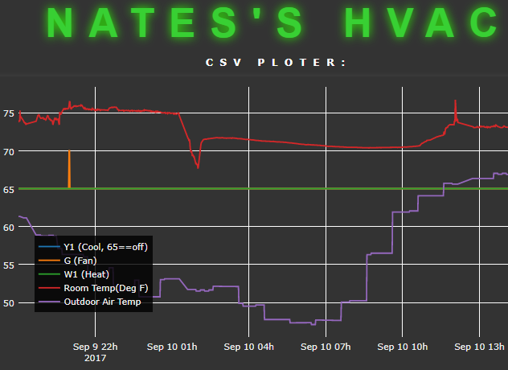
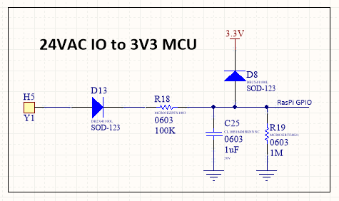
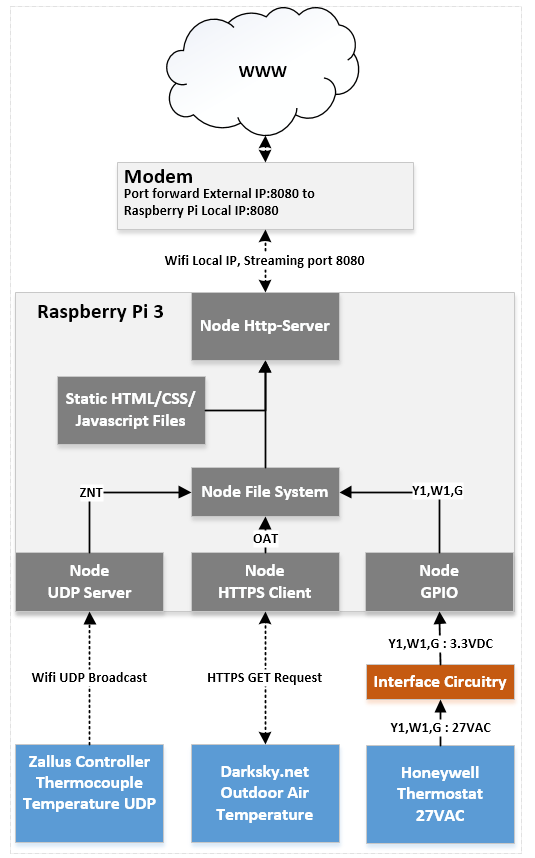
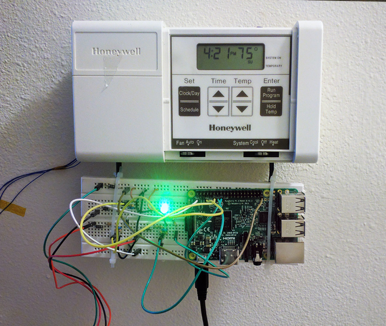

# How 2 Read HVAC Signal Thingeys

**Disclaimer**: Don't try any of this anywhere anytime. You may accidentally kill yourself and or probably destroy your HVAC system costing you 1000s of dollars. 

**Exciting Premise:** That which has plagued you your whole life now can be alleviated with this one simple trick. Complete knowledge of your HVAC system which, undoubtly has been childhood dream, can now be obtained. In addition to fulfilling this hole in my own personal humanity, it provides useful data for work. The annoying part is it requires some tribal knowledge which is not very common on the internets because most people/nerds don't care about their thermostat. Consequently this guide will provide some information with the end goal of logging/viewing data from ones thermostat.  The end goal is to produce something similar to the following: 

    

## Common Thermostat Electrical Specifications:
Commonly, atleast in the USA, HVAC (Heating,Ventalation,Air Conditioning) systems are 24 VAC systems. They often exist as 4 wire, 5 wire, and 7+ wire thermostats as shown below:

    

Most commonly is the older thermostat which is a 4-wire thermostat. These thermostats by majority require a battery for power if they are electric in nature. Next most common is a 5-wire that contains both power wires as well as wires for heating,cooling and fan control. Finally, more elaborate Thermostats may have multiple stages of heating/cooling, may have auxillary devices...ect. Keep in mind that each of these is a 24 VAC signals. Often externally **W1,Y1,G** will be connected to power externally such as **RH**. The Thermostat completes the circuit to turn on an output, such as heating, by connecting **W1** to **C**. This completed circuit resultes in current flowing through **W1** which the heating system will detect and subsequently enable the heating system. Often, these wires are not high wattage so these are merely signal wires and not powering wires. 

## GPIO Input Conditioning 

Most MCUs are 3.3V and regrettably cannot have 24VAC fed directly to the IO wires. The following circuit is used to bring this voltage to a safe value.

    

Naturally this circuit rectifies the VAC signal to VDC and clamps the voltage at ~3.7V which is 'safe enough' sorta for a 3.3VDC MCU. Use at your own risk, this was done because I was lazy. Note, what is ground? Careful with grounding, the ground should be the GND of the PI and **C**. 

## Software Architecture 

In addition to monitoring **Y1,W1,G**, data is not complete without **ZNT**(Zone Temperature) and **OAT**(Outdoor Air Temperature). I would argue that the Raspberry Pi is a very effective/cheap data platform for storing and displaying data. This is the hub that can collect **ZNT** and **OAT** from external sources. 

Measuring **ZNT** directly from the thermostat is dangerous since it may influnce the temperature accuracy unless done very carefully. I decided to re-use one of my Zallus Controllers running modified firmware to read from its thermocouple and broadcast the result to a subnet of 255 on a UDP port. This broadcast can be easily read by the Raspberry PI. 

Obtaining **OAT** can be done simply with **[Darksky](https://darksky.net/dev)**. The Raspberry PI simply needs to make an HTTPS GET request to Darksky with an API key as well as latitude and longitude. The resulting JSON can be trivially parsed to find the **OAT**.  

Now, I would also argue that **[NodeJS](https://nodejs.org/en/)** is the most superior higher level coding ecosystem to create simple programs. This language makes HTTPS requests, HTTP requests, GPIO manipulation, timing, scheduling, file system access, UDP requests, and quality GUI creation trivial. One may argue that python could have been used instead but python really cannot compete on the ease of GUI creation since it does not leverage the enterity of the worlds largest coding ecosystem which is the World-Wide-Web. With that in mind, here is a diagram of the software: 

    

and with this software magic one can get the following result: 

    

## Lovely Hardware:

    

## Conclusion:

Now you are a master of the HVACs. Good job!